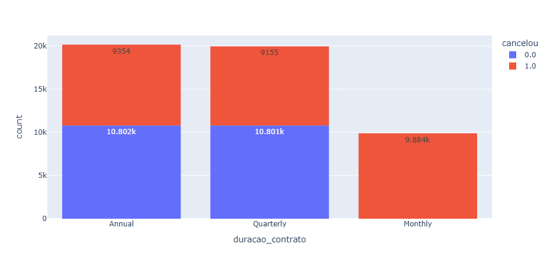

# 📊 Análise de Cancelamento em Planos de Assinatura (Churn)

Este projeto tem como objetivo analisar o comportamento de cancelamento de clientes em um modelo de negócio baseado em assinatura.

A pergunta principal foi:

**Clientes de quais tipos de plano cancelam mais?**

---

## Contexto

Empresas que trabalham com planos mensais, trimestrais e anuais precisam entender quais contratos apresentam maior risco de churn (cancelamento), pois isso impacta diretamente a previsibilidade de receita e estratégias de retenção.

---

## 📊 Insight Principal

  

A análise mostra que clientes com plano **Monthly** apresentam maior volume de cancelamentos em comparação com planos **Quarterly** e **Annual**.

Isso sugere que contratos de curto prazo possuem menor retenção, enquanto planos de longo prazo tendem a fidelizar mais clientes.

---

## O que foi feito

- Análise exploratória dos dados
- Comparação de cancelamentos por tipo de contrato
- Identificação de padrões associados ao churn
- Interpretação estratégica dos resultados

---

## Ferramentas Utilizadas

- Python
- Pandas
- Plotly
- Jupyter Notebook

---

## Próximos Passos

- Calcular taxa percentual de churn por plano
- Desenvolver modelo preditivo de cancelamento
- Criar dashboard interativo para tomada de decisão

---

## 👨‍💻 Sobre mim

Projeto desenvolvido como parte da minha evolução em Análise de Dados, com foco em transformar dados em insights estratégicos para negócio.
